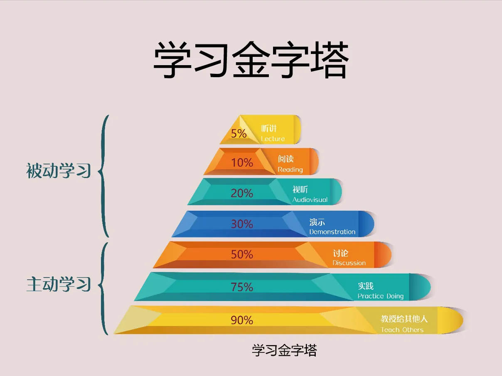
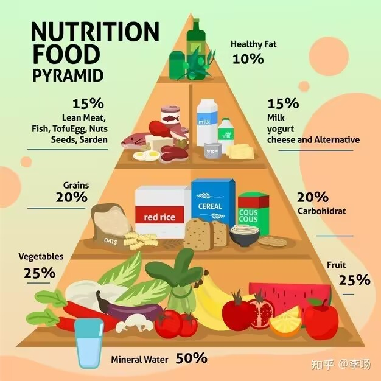
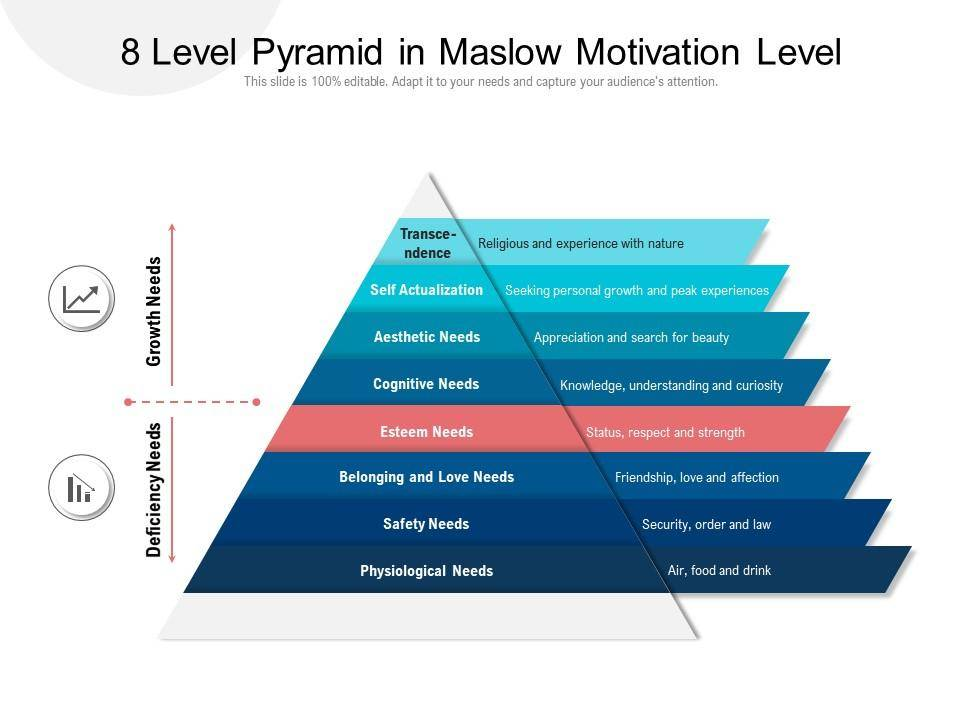
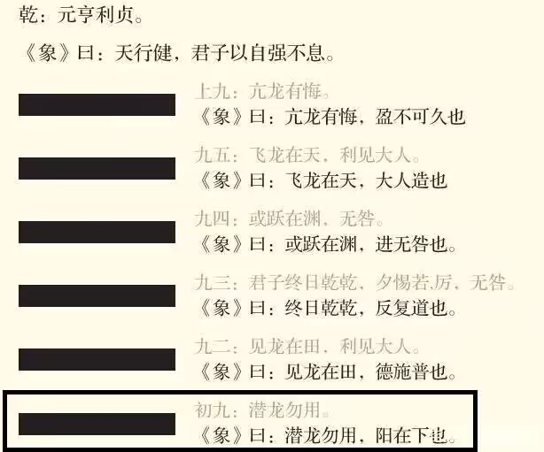

# 本科 | 计算机科学与技术 | 潜龙勿用

## 海贼王

世代传承的意志

时代的浪潮

人的梦想

这些都是无法阻挡的

只要人们继续追求自由的解答

这一切都将永不停息


      


```
有哪些书非常有利于年轻人未来发展？  

排名不分先后

炮学

以年龄阶段分析炮友的适合群体与相处之道

腿学

以成功人士具体案例分析如何抱大腿

逼学

全面讲解衣食住行之后的人类第五大需求（装逼）

不过以上三本书我还在构思中

到现在一个字还没写呢

你要是觉得还年轻，你就等等我，没事就催催我

老的就算了吧……

发布于 2018-11-13 10:17

作者：金陵小老头
链接：https://www.zhihu.com/question/275351176/answer/530420618
来源：知乎
著作权归作者所有。商业转载请联系作者获得授权，非商业转载请注明出处。

我再加个 

**

****************
```

 
## 计算机


能力不如我的同学，秋招拿到了60w+的offer，心里非常难受是怎么回事？ 

高国彬的回答 - 知乎
https://www.zhihu.com/question/496689201/answer/2257222872

看了之后有感而发：

答主说的好至极，豁然开朗心存激。  
才知以前盲跟风，原来学个空肚皮。  
随即开学真功夫，不然以后真gg。  
家里没钱也没地，小偷看了掩面泣。  
待我奋斗苦学习，兰博基尼身下骑[😘]  


 

    计算机本科应届毕业生要有怎样的能力才算比较好的？  
    
    摘要：

    所谓认真学过专业课的程度是：

    熟练掌握数门语言
    熟练掌握一个平台
    熟练掌握、理解算法和数据结构
    掌握编译原理、操作系统、网络、图形、数据库等专业课程知识
    认可《软件工程》 

    能达到这个程度的本科生，可以随便秒大部分水硕
    
    那么回到正题，我觉得本科生具体应该学好的知识如下 ：

    语言：C和scheme，两个极端范式足够了
    数据结构和算法，《算法导论》
    计算机系统，《csapp》
    软件工程，《sicp》  

    完，这太简单了。。

    作者：萧井陌
    链接：https://www.zhihu.com/question/25753307/answer/31518801
    来源：知乎
    著作权归作者所有。商业转载请联系作者获得授权，非商业转载请注明出处。


## 金字塔














    知乎大佬：
    
    做事、立名、混圈和人脉搞反了哪一个，这辈子都很难成大事。

    做事: 你自己得行：有一个主战场，有拿的出手的东西

    立名：有人说你行

    混圈：说你行的人也得行

    人脉：你能调动，能帮你忙的人才叫"人脉"

